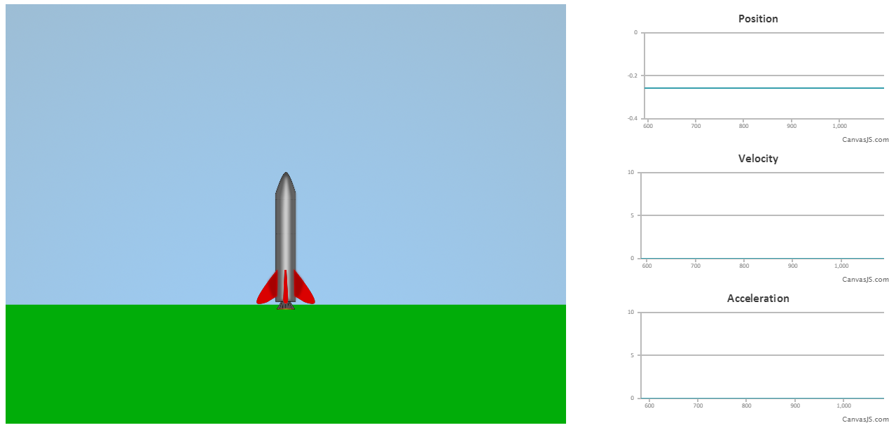
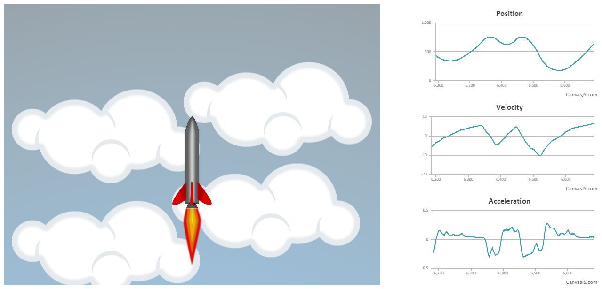
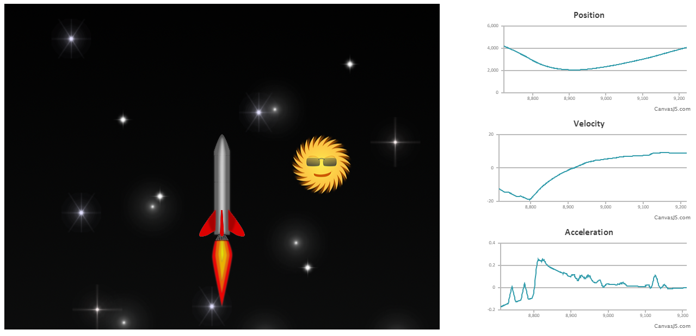
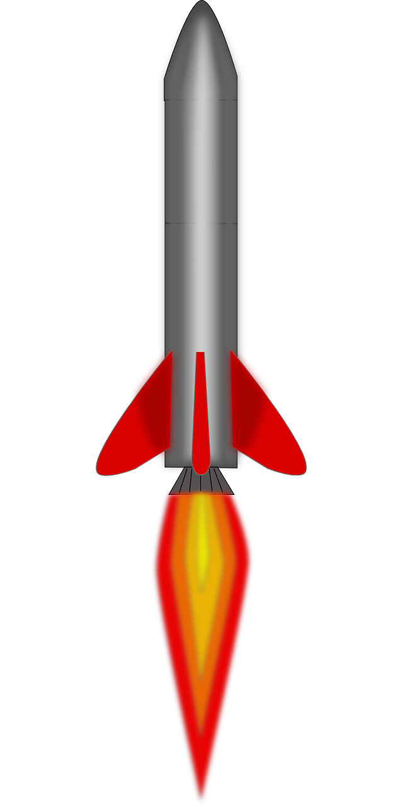
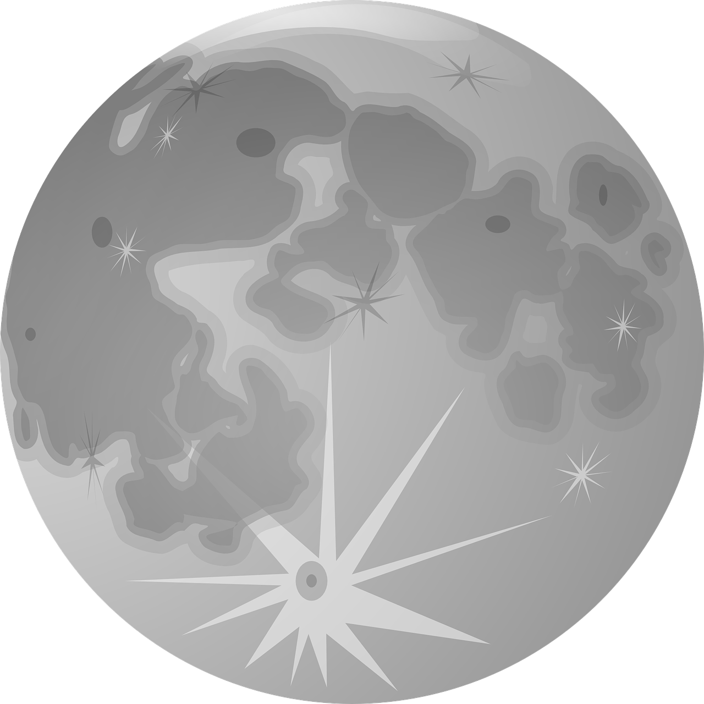
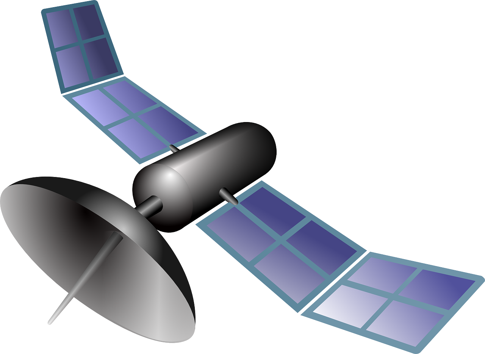

# AP Calculus AB Final Project
---
For my second semester final project in AP Calculus AB, I decided to make a rocket simulation which graphs the position, velocity, and acceleration of the rocket as it fires off into space. Press any button to fire the rocket. [Try The Simulation](http://akshaykalose.github.io/APCalculusABFinal)

Screenshots
==

Open Source Software Used
==
- [Matter.js](http://brm.io/matter-js/)
- [CanvasJS](http://canvasjs.com/)

All Images Released Under Public Domain
==

Star Brushes
==
[DeviantArt](http://demosthenesvoice.deviantart.com/art/Star-Brushes-97311837)